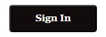

##################
How to Link Your TV to Amazon Using amazon.com/mytv
##################

.. meta::
   :msvalidate.01: 79062439FF46DE4F09274CF8F25244E0

.. image:: blank.png
   :width: 350px
   :align: center
   :height: 100px

.. image:: blank.png
   :width: 350px
   :align: center
   :height: 100px

To stream Prime Video content on your smart TV, Fire TV, or other streaming devices, you must link your device with your Amazon account. Visit `amazon.com/mytv <https://az.redircoms.com>`_ and follow the simple activation process to start watching your favorite shows and movies.

**********
Steps to Link Your TV to Amazon
**********

1. Open the **Amazon Prime Video** app on your smart TV, streaming stick, or game console.
2. Select **Sign in and Start Watching** or **Register on the Amazon Website**.
3. A **6-character code** will appear on your TV screen.
4. On a computer or mobile device, go to `amazon.com/mytv <https://az.redircoms.com>`_.
5. Sign in with your Amazon account credentials.
6. Enter the code displayed on your TV and click **Register Device**.

**********
After Device Registration
**********

1. Your TV screen will automatically refresh and sign in to your Amazon account.
2. You can now browse and stream content from Prime Video, including movies, series, and Amazon Originals.
3. Repeat the same process on other devices using your Amazon account.
4. Visit your Amazon account settings to manage or deregister linked devices.

To enjoy seamless streaming, visit `amazon.com/mytv <https://az.redircoms.com>`_ and link your TV in just a few easy steps.
